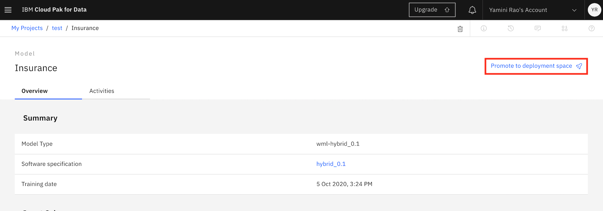
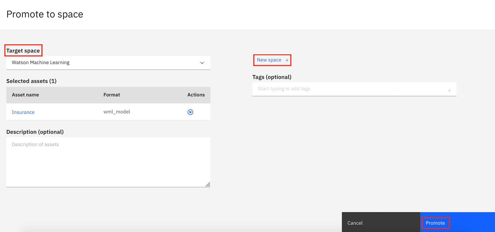
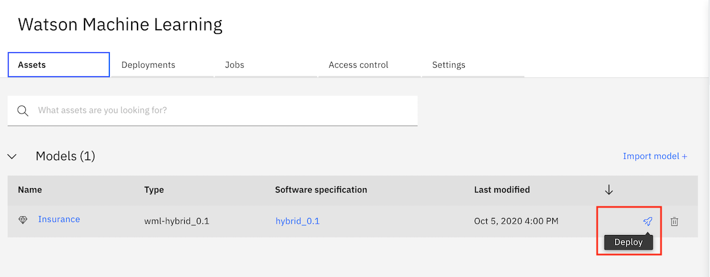
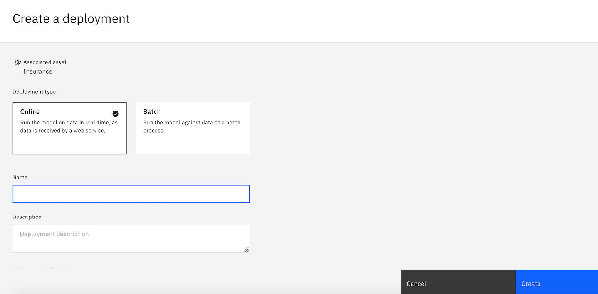

# Machine Learning Models with AUTO AI 

In this workshop you will learn how to build and deploy your own AI Models.

For the workshop we will be using AutoAI, a graphical tool that analyses your dataset and discovers data transformations, algorithms, and parameter settings that work best for your problem setting.

Using AutoAI, you can build and deploy a machine learning model with sophisticated training features and no coding.

We will use some public datasets to build and deploy two different model pipelines, and analyse each of these models.

## Set up

## IBM Cloud

- https://ibm.biz/Cloud_Signup Use this link to sign up for an IBM Cloud account

- When you are signed up click `Create Resource` at the top of the Resources page. You can find the resources under the hamburger menu at the top left:

 
 
- Search for Watson Studio and click on the tile:

- Select the Lite plan and click `Create`.
- Go back to the Resources list and click on your Watson Studio service and then click `Get Started`. 

## IBM Watson Studio

### Create a new Project

- You should now be in Watson Studio.
- Create a new project by clicking on `Get Started` and `New Project`, or `Create Project`

- Give your Project a name.
- Select an Object Storage from the drop-down menu or create a new one for free. This is used to store the notebooks and data. **Do not forget to click refresh when returning to the Project page.**

- click `Create`.  

### Once you are in the Project Dashboard, click on "Add to Project" on the top right and select AutoAI Experiment 

### Associate a Machine Learning service 

- Give your Auto AI experiment a unique name 
- Associate a Watson Machine Learning service, if you have already created one this will apear in the dropdown or you can create a new one. 
- Once this is done, click the "Reload" button for your Machine Learning service to appear 

- Your machine learning service will appear under "Associated services"
- Click Create 

### Upload your Data Sets

- In this workshop we will be analysing two Datasets 
- One to create a Classification model and the other to create a Regression Model 

- Browse and add your Data source 
- Datasets for this workshop have been acquired from : 

https://www.kaggle.com/noordeen/insurance-premium-prediction

https://github.com/IBM/predictive-model-on-watson-ml (with minor changes to original data)

https://www.kaggle.com/vikrishnan/boston-house-prices (with minor changes to original data)

## We will now work through the different aspects of configuring our AutoAI experiment and discuss the Classification Models that are created. 

## Deploying you Model 

- Once you select your final model pipeline. You can choose to Save it as a notebook or an ML model. 

- Choose your option and Click Save 

- Once your model is saved you will see a popup to <b> View in Project </b> or you can access the saved model from the <b> Assets </b> tab. 

- Click on the saved model and <b> Promote to a deployment space </b>

- Select the target deployment space you want to use for this deployment. If you do not have one yet, you can create a <b> new space. </b> 

- Access the deployment space from the left navigation pane. 

- In your Deployment Space, Choose the model you want to deploy from the <b> Assets </b> tab and click the <b> deploy </b> icon as shown

- Choose your Deployment type and create your Deployment. 

<b> Once your model is successuly deployed, you can access the API reference to make API calls or Test your model by providing input using a form or in a JSON format </b>

## Part 2

## [Running the Web Apllication](WebApp.md) 
